# phac-nml/viralassembly: Output

## Introduction

This document describes the output produced by the pipeline. Most of the plots are taken from either the MultiQC report or the custom report, which both summarise the results at the end of the pipeline.

The directories listed below will be created in the results directory after the pipeline has finished. All paths are relative to the top-level results directory.

## Pipeline overview

The pipeline is built using [Nextflow](https://www.nextflow.io/) and processes data using the following steps (where a `*` indicates a final output kept in the top level results directory):

- [Preprocessing](#preprocessing)
  - [Reference Stats](#reference-stats)* - Get reference genome information needed for variant calling and QC
  - [Artic Guppyplex](#artic-guppyplex) - Read length filtering
  - [Chopper](#chopper) - Additional Read QC
  - [Nanostat](#nanostat) - Read statistics

- [Variant Calling](#variant-calling)
  - [Minimap2](#minimap2)* - Read mapping
  - [Artic Align Trim](#artic-align_trim)* - Primer trimming and normalisation
  - [Clair3](#clair3) - Determine initial variants with clair3
  - [Medaka](#medaka) - Determine initial variants with medaka
  - [Nanopolish](#nanopolish) - Determine initial variants with nanopolish
  - [Longshot](#longshot)* - Genotype and phase called medaka variants
  - [Variant Filter](#variant-filter)* - Filter variants not matching required criteria

- [Consensus Generation](#consensus-generation)
  - [Artic Mask](#artic-mask) - Mask failing variants and low depth sites in preparation for consensus generation
  - [BCFtools Norm](#bcftools-norm)* - Left-align and normalize indels along with make sure the reference alleles match
  - [BCFtools Consensus](#bcftools-consensus)* - Create consensus sequence from VCF variants and Masked sites

- [QC and Reporting](#qc-and-reporting)
  - [SnpEff](#snpeff) - Variant annotation and functional prediction
  - [Qualimap BAMQC](#qualimap-bamqc) - Alignment quality and metrics
  - [Samtools Flagstat](#samtools-flagstat) - Alignment flag stats
  - [BCFtools Stats](#bcftools-stats) - Variant quality and statistics
  - [Variation CSV](#variation-csv) - Custom reporting script for finding and calculating variation in the BAM pileups
  - [Amplicon Completeness](#amplicon-completeness) - Custom reporting script for calculating amplicon completeness based on bedtools output
  - [QC Compilation](#qc-compilation) - Custom reporting scripts for each sample and the overall run
  - [MultiQC](#multiqc) - Sample and Run HTML visual report
  - [Custom Report](#custom-report) - Custom HTML Run visual report

Additionally [Pipeline information](#pipeline-information) which includes report metrics generated during the workflow execution can also be found

### Preprocessing
Initial processing steps and statistic gathering. The reference statistics are output to their own final folder while the other statistics are passed to the final multiqc report.

#### Reference Stats

Output files

- `reference/`
  - `genome.bed`: Genomic information in bed format that has the coordiantes of the reference genome needed for nanopolish
  - `refstats.txt`: Genomic information in a format needed for clair3
  - `*.fai`: Samtools faidx fai file for reference genome

The reference files are generated with both `awk` and `samtools` and are needed as different inputs for downstream tools.

#### Artic Guppyplex
Select reads by size and generate size selected fastq files.

#### Chopper
[Chopper](https://github.com/wdecoster/chopper) filter and trim fastq reads by quality and length.

#### Nanostat
[Nanostat](https://github.com/wdecoster/nanostat) generates plots and statistics on trimmed fastq files for the final multiqc reports.

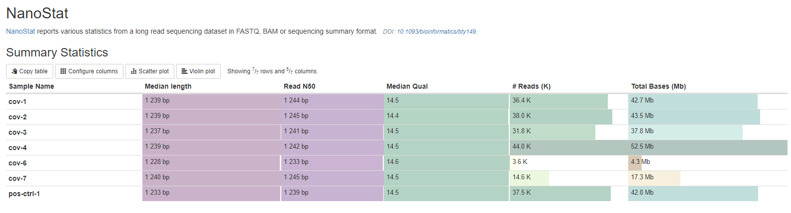

----------

### Variant Calling
Read mapping and variant calling. Note that only one of `clair3`, `medaka`, and `nanopolish` is used. In the end, final normalized passing and failing variants are output along with the BAM files to their respective folders.

#### Minimap2

Output files

- `bam/`
  - `*.sorted.bam`: Sorted bam file from minimap2 and samtools

The sorted BAM file from minimap2 and samtools.

#### Artic Align_Trim
*Amplicon only*

Output files

- `bam/`
  - `*.trimmed.rg.sorted.bam`: Artic align_trim output which normalises coverage and assigns reads to amplicons
  - `*.primertrimmed.rg.sorted.bam`: Artic align_trim output which normalises coverage and assigns reads to amplicons along with softmasking the primer sequences
    - The primertrimmed file is used for subsequent variant calling

See [the artic core pipeline](https://artic.readthedocs.io/en/latest/minion/#core-pipeline) for more info on how `align_trim` trims the BAM files.

#### Clair3
Run clair3 variant caller on BAM files to create initial variant calls in VCF format.

#### Medaka
Run medaka variant caller on BAM files to create initial variant calls in VCF format.

#### Nanopolish
Run nanopolish variant caller on BAM files, fast5 files, and the sequencing summary file to create initial variant calls in VCF format.

#### Longshot

Output files

- `vcf/`
  - `*.longshot.merged.vcf`: Longshot phased VCF file

Genotype and phase the variants from the initial medaka VCF variant file. [Longshot](https://github.com/pjedge/longshot)

#### Variant Filter

Output files

- `vcf/`
  - `*.pass.vcf.gz`: VCF file containing variants passing quality filters
  - `*.pass.vcf.gz.tbi`: VCF index file containing variants passing quality filters
  - `*.fail.vcf`: VCF file containing variants failing quality filters

Pass/Fail variants based on quality for the final consensus sequence generation.

----------

### Consensus Generation
Final consensus sequence generation based on passing/failing variants and sequencing depth.

#### Artic Mask
Mask low depth and failing variants to create a preconsensus sequence for BCFtools consensus.

#### BCFtools Norm

Output files

- `vcf/`
  - `*.pass.norm.vcf.gz`: VCF file containing variants passing quality filters that have their indels normalized and reference positions fixed
    - Reference positions may need to be fixed if there are overlapping variants

BCFtools norm is utilized to fix locations in which one two variants overlap which during BCFtools consensus would crash the pipeline previously. [BCFtools](https://samtools.github.io/bcftools/bcftools.html#norm)

#### BCFtools Consensus

Output files

- `consensus/`
  - `*.consensus.fasta`: Fasta file containing the final output consensus sequence with applied variants and masked sites

Final output consensus sequence for the sample with variants applied and low coverage/failing variants masked with N's. [BCFtools](https://samtools.github.io/bcftools/bcftools.html#norm)

----------

### QC and Reporting
All QC and reporting is only currently done on non-segmented viruses

#### SnpEff

Output files

- `snpeff/`
  - `*.ann.vcf`: VCF file with variant annotations
  - `*.csv`: Variant annotation csv file

[SnpEff](https://pcingola.github.io/SnpEff/) is a genetic variant annotation and functional effect prediction toolbox. It annotates and predicts the effects of genetic variants on genes and proteins (such as amino acid changes).

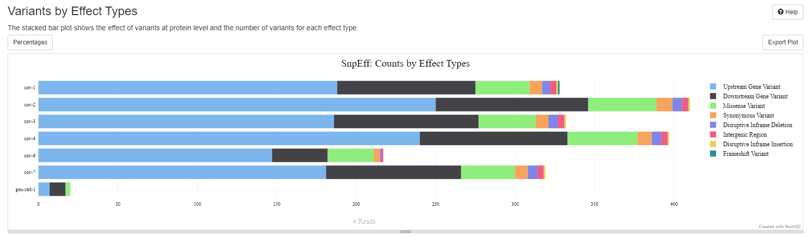

#### Qualimap BAMQC
[Qualimap BAMQC](http://qualimap.conesalab.org/) platform-independent application written in Java and R that provides a command-line interface to facilitate the quality control of alignment sequencing data and its derivatives like feature counts. The output is used in the final MultiQC reports.

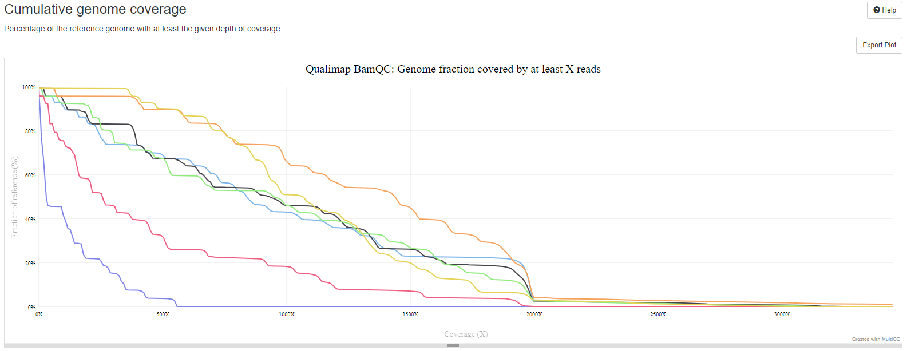

#### Samtools Flagstat
[Samtools flagstat](http://www.htslib.org/doc/samtools-flagstat.html) counts the number of alignments for each FLAG type. The output is used in the final MultiQC reports.

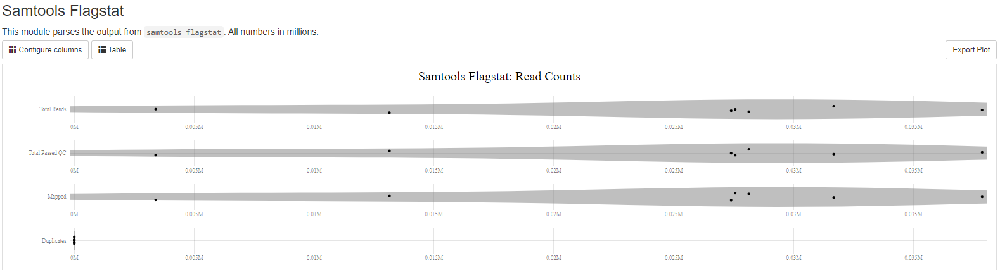

#### BCFtools Stats
[BCFtools stats](https://samtools.github.io/bcftools/bcftools.html#stats) produces machine readable variant quality and statistics. The output is used in the final MultiQC reports

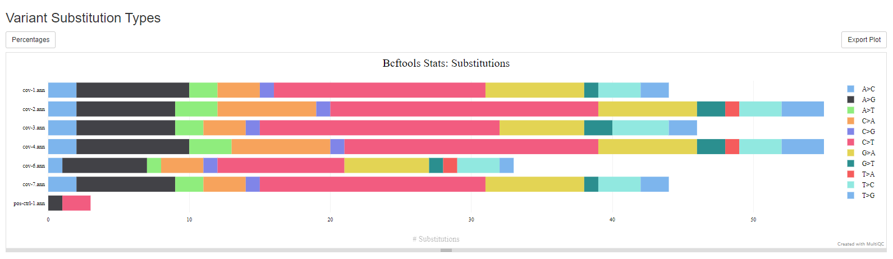

#### Variation CSV

Output files

- `variation_csvs/`
  - `*_variation.csv`: CSV file displaying positions where there is >= 15% variation from the reference base call

Custom python script using [pysam](https://pysam.readthedocs.io/en/latest/api.html) to find positions in the pileup which have >= 15% variation from the reference sequence. This gives information on any mixed-sites along with identifying spots in the genome where there may be sequencing artifacts or issues. The CSV file can be viewed or a coloured table can be found in each sample MultiQC report or custom report.

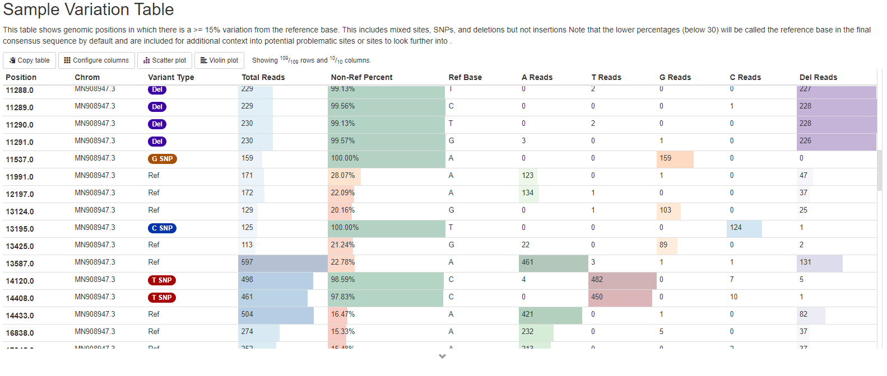

#### Amplicon Completeness
Amplicon completeness is calculated using a custom python script along with an amplicon bed file and the final consensus sequence. It reports how many bases were called in each amplicon and gives a final completeness value from `0` - `1.00`.

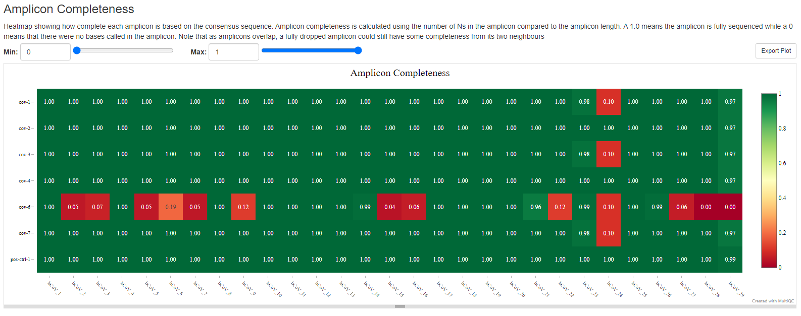

#### QC Compilation

Output files

- `sample_csvs/`
  - `*.qc.csv`: Individual sample CSV files containing sample stats
- `overall.qc.csv`: Overall sample and run CSV file containing all sample stats

Final CSV file(s) for both individual samples and the overall run that combines and checks a variety of metrics giving a final QC value for each sample.

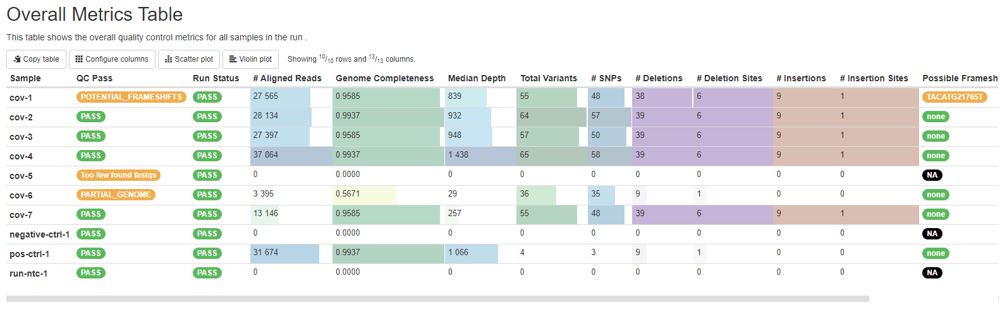

#### MultiQC

Output files

- `sample_mqc/`
  - `*.report.html`: Sample specific MultiQC HTML report containing visuals and tables 
- `Overall-Run-MultiQC.report.html`: Final overall MultiQC report containing visuals and tables for all samples combined

Final output reports generated by [MultiQC](https://multiqc.info/docs/) based on the [overall config](../assets/multiqc_config_overall.yaml) and the [sample config](../assets/multiqc_config_sample.yaml) files which collate all of the outputs of the pipeline

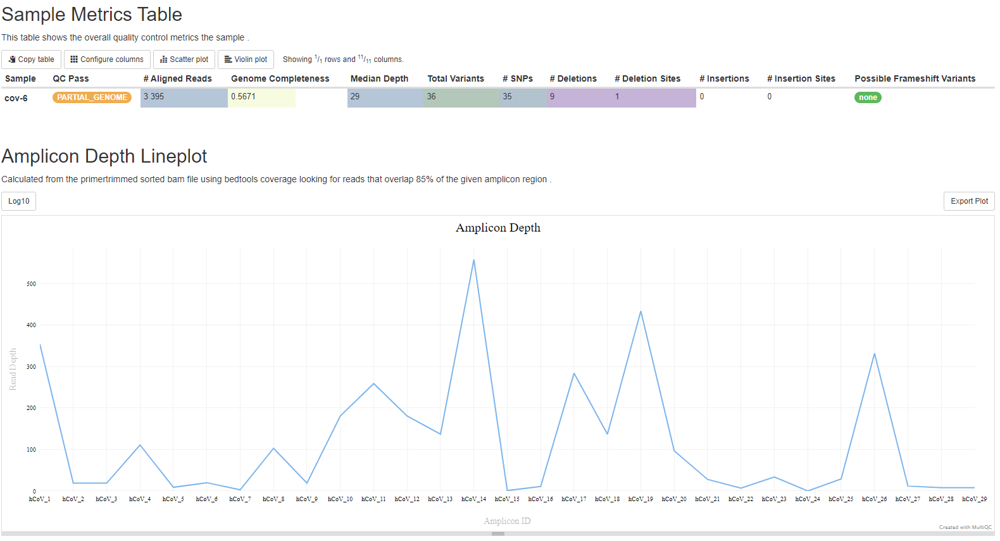

#### Custom Report

Output files

- `reportDashboard.html`: Custom report dashboard displaying run metrics overall and for each sample

Custom RMarkdown report that contains sample and run information. Currently it can only be generated when running with `conda` so it is an output that has to be specified. It also still has a few issues relating to load times.

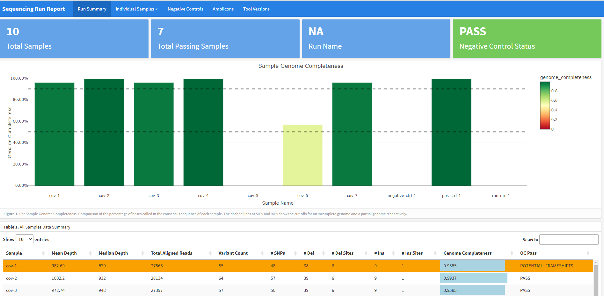
Run summary page

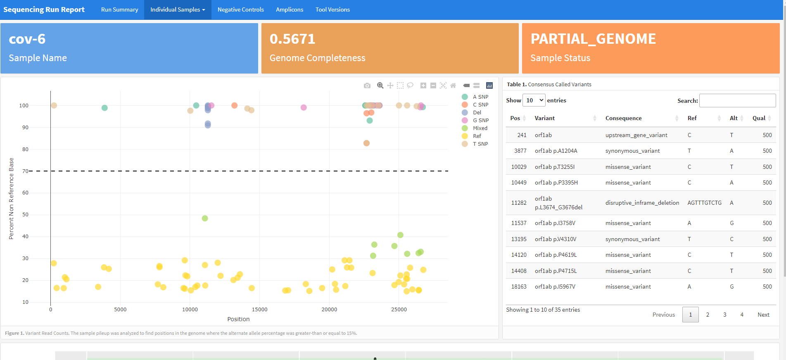
Example sample page

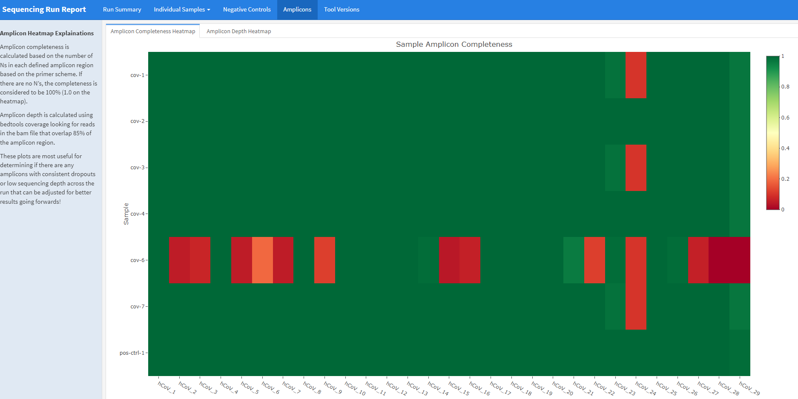
Amplicons page

----------

### Pipeline information

Output files

- `pipeline_info/`
  - Reports generated by Nextflow: `execution_report.html`, `execution_timeline.html`, `execution_trace.txt` and `pipeline_dag.dot`/`pipeline_dag.svg`.
  - Reports generated by the pipeline: `pipeline_report.html`, `pipeline_report.txt` and `software_versions.yml`. The `pipeline_report*` files will only be present if the `--email` / `--email_on_fail` parameter's are used when running the pipeline.
  - Reformatted samplesheet files used as input to the pipeline: `samplesheet.valid.csv`.
  - Parameters used by the pipeline run: `params.json`.

[Nextflow](https://www.nextflow.io/docs/latest/tracing.html) provides excellent functionality for generating various reports relevant to the running and execution of the pipeline. This will allow you to troubleshoot errors with the running of the pipeline, and also provide you with other information such as launch commands, run times and resource usage.
