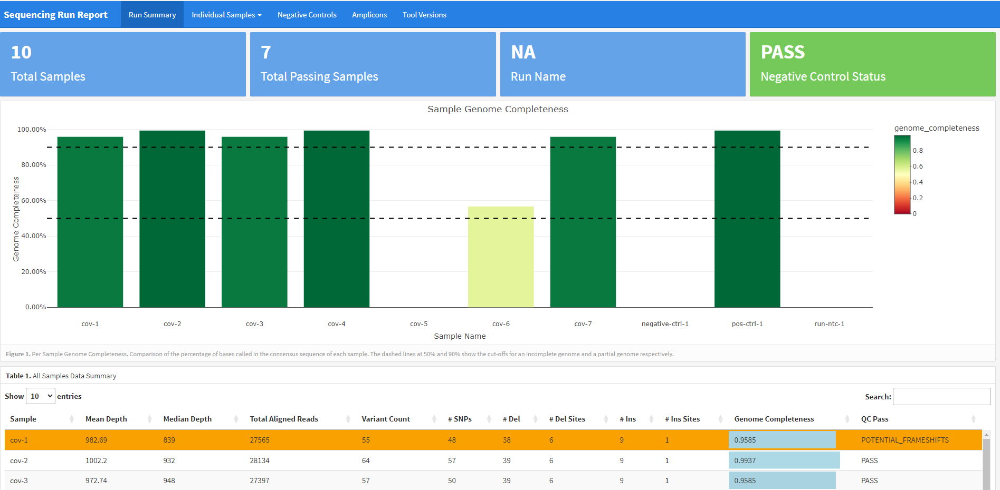
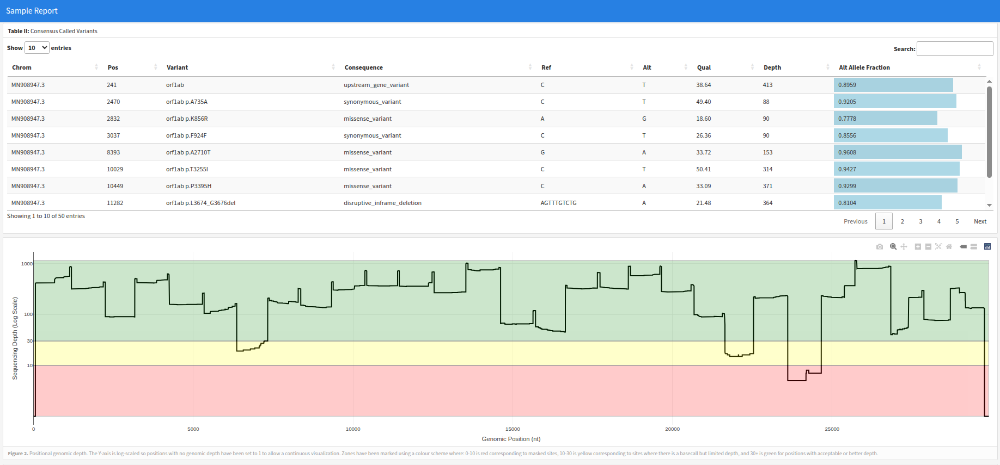
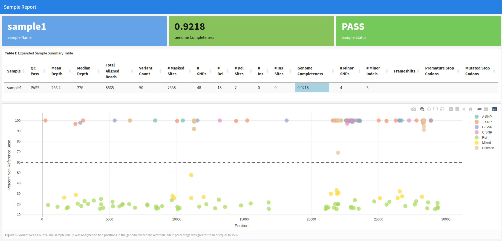
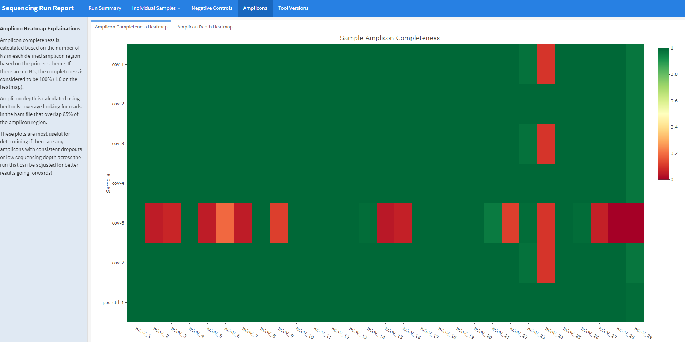

# phac-nml/viralassembly: Output

## Introduction

This document describes the output produced by the pipeline. The exact files generated depend on the sequencing platform, the sequencing approach, and the optional analyses enabled for each pipeline run.

The pipeline supports both:

- Oxford Nanopore sequencing
- Illumina sequencing

As Nanopore and Illumina data use seperate consensus generation workflows before converging on common downstream steps, the pipeline output may vary slightly.

Most QC plots and summary tables are included in the custom reports generated at the end of the pipeline.

The directories listed below are created within the directory specified by `--outdir` after the pipeline has finished. All paths are relative to the top-level results directory.

## Pipeline overview

The pipeline is built using [Nextflow](https://www.nextflow.io/) and processes data using the following steps:

- [phac-nml/viralassembly: Output](#phac-nmlviralassembly-output)
  - [Introduction](#introduction)
  - [Pipeline overview](#pipeline-overview)
    - [Reference and Primer Processing](#reference-and-primer-processing)
      - [Reference Stats](#reference-stats)
      - [Primer Validation and Processing](#primer-validation-and-processing)
    - [Nanopore Consensus Generation](#nanopore-consensus-generation)
      - [Artic Guppyplex](#artic-guppyplex)
      - [Chopper](#chopper)
      - [Minimap2](#minimap2)
      - [Artic Align Trim](#artic-align-trim)
      - [Clair3](#clair3)
      - [Artic Variant Filter](#artic-variant-filter)
      - [Artic Mask](#artic-mask)
      - [BCFtools Norm](#bcftools-norm)
      - [BCFtools Consensus](#bcftools-consensus)
    - [Artic Minion](#artic-minion)
    - [Illumina Consensus Generation](#illumina-consensus-generation)
      - [FastP](#fastp)
      - [Bowtie2 \& Samtools Sort](#bowtie2--samtools-sort)
      - [Artic Align Trim](#artic-align-trim-1)
      - [FreeBayes](#freebayes)
      - [iVar Variant Calling](#ivar-variant-calling)
      - [Process VCF and BCFtools Norm](#process-vcf-and-bcftools-norm)
      - [BCFtools Filter](#bcftools-filter)
      - [Tabix](#tabix)
      - [Masking](#masking)
      - [Make](#make)
      - [BCFtools Consensus](#bcftools-consensus-1)
    - [QC and Reporting](#qc-and-reporting)
      - [SnpEff](#snpeff)
      - [Nextclade](#nextclade)
      - [QC Compilation](#qc-compilation)
      - [Custom Report](#custom-report)
    - [Pipeline information](#pipeline-information)

### Reference and Primer Processing

Initial processing steps to index the reference fasta and validate the primer file.

#### Reference Stats

Output files

- `reference/`
  - `genome.bed`: Genomic information in bed format that has the coordiantes of the reference genome
  - `*.fai`: Samtools faidx fai file for reference genome
  

The reference files are generated with both `awk` and `samtools` and are needed as different inputs for downstream tools.

#### Primer Validation and Processing

Output files

- `bed/`
  - `*.bed`: amplicon BED file, split pool BED files, or tiling BED file.
  

The validation and processing is done through [primalbedtools](https://github.com/ChrisgKent/primalbedtools). Pools splitting and tiling region creation are generated with `awk`

### Nanopore Consensus Generation

The following steps are specific to the Nanopore consensus generation workflow invoked with `--platform nanopore`

#### Artic Guppyplex

[Artic Guppyplex](https://github.com/artic-network/fieldbioinformatics/blob/master/artic/guppyplex.py) filters Nanopore reads by specified read length.

#### Chopper

[Chopper](https://github.com/wdecoster/chopper/) filters Nanopore reads based on sequencing quality.

#### Minimap2

Output files

- `bam/`
  - `*.sorted.bam`: Sorted bam file from minimap2 and samtools
  

[Minimap2](https://github.com/lh3/minimap2) aligns the filtered Nanopore reads to the reference genome and produces a sorted BAM file.

#### Artic Align Trim

_Amplicon only_

Output files

- `bam/`
  - `*.trimmed.rg.sorted.bam`: Artic align_trim output which normalises coverage and assigns reads to amplicons
  - `*.primertrimmed.rg.sorted.bam`: Artic align_trim output which normalises coverage and assigns reads to amplicons along with softmasking the primer sequences - The primertrimmed file is used for subsequent variant calling
  

See [the artic core pipeline](https://artic.readthedocs.io/en/latest/minion/#core-pipeline) for more info on how `align_trim` trims the BAM files.

#### Clair3

Output files

- `vcf/clair3/`
  - `*.vcf`: Called variants by Clair3
  

Initial variant calls in VCF format.

#### Artic Variant Filter

Output files

- `vcf/clair3/`
  - `*.pass.vcf.gz`: VCF file containing variants passing quality filters
  - `*.pass.vcf.gz.tbi`: VCF index file containing variants passing quality filters
  - `*.fail.vcf`: VCF file containing variants failing quality filters
  

Pass/Fail variants based on quality for the final consensus sequence generation.

#### Artic Mask

Mask low depth and failing variants to create a preconsensus sequence for BCFtools consensus.

#### BCFtools Norm

Output files

- `vcf/final`
  - `*.consensus.norm.vcf.gz`: VCF file containing variants passing quality filters that have their indels normalized and reference positions fixed
  

[BCFtools](https://samtools.github.io/bcftools/bcftools.html#norm) Norm is utilized to fix locations in which two variants overlap which during BCFtools consensus would crash the pipeline previously.

#### BCFtools Consensus

Output files

- `consensus/`
  - `*.consensus.fasta`: Fasta file containing the final output consensus sequence with applied variants and masked sites
  

[BCFtools](https://samtools.github.io/bcftools/bcftools.html#norm) creates the final output consensus sequence for the sample with variants applied and low coverage/failing variants masked with N's.

### Artic Minion

Output files

- `consensus/`
  - `*.consensus.fasta`: Fasta file containing the final output consensus sequence with applied variants and masked sites
- `bam/`
  - `*.bam`: Aligned BAM file
- `vcf/`
  - `*.pass.vcf.gz`: VCF file containing variants passing quality filters
  - `*.pass.vcf.gz.tbi`: VCF index file containing variants passing quality filters
  - `*.fail.vcf`: VCF file containing variants failing quality filters
  

Runs Artic Minion analysis workflow to perform alignment, variant calling, and consensus generation instead of the adapted Nanopore consensus generation workflow.

### Illumina Consensus Generation

The following steps are specific to the Illumina consensus generation workflow invoked with `--platform illumina`

#### FastP

Performs quality filtering and adapter trimming of Illumina reads.

#### Bowtie2 & Samtools Sort

Output files

- `bam/`
  - `*.sorted.bam`: Sorted bam file from bowtie2 and samtools
  

The sorted BAM file from [bowtie2](https://github.com/BenLangmead/bowtie2) and [SAMtools](https://github.com/samtools/samtools).

#### Artic Align Trim

_Amplicon only_

Output files

- `bam/`
  - `*.trimmed.rg.sorted.bam`: Artic align_trim output which normalises coverage and assigns reads to amplicons
  - `*.primertrimmed.rg.sorted.bam`: Artic align_trim output which normalises coverage and assigns reads to amplicons along with softmasking the primer sequences - The primertrimmed file is used for subsequent variant calling
  

See [the artic core pipeline](https://artic.readthedocs.io/en/latest/minion/#core-pipeline) for more info on how `align_trim` trims the BAM files.

#### FreeBayes

Output files

- `vcf/freebayes/`
  - `*.vcf`: Called variants by FreeBayes
  

Initial variant calls in VCF format.

#### iVar Variant Calling

_Optional Illumina Variant Caller: iVar_

Output files

- `vcf/ivar/`
  - `*.vcf`: Called variants by Ivar
  

Initial variant calls in VCF format through iVar and Bcftools Sort

#### Process VCF and BCFtools Norm

Output files

- `vcf/final`
  - `*.consensus.norm.vcf.gz`: VCF file containing variants passing quality filters that have their indels normalized and reference positions fixed
  

Uses both a custom python script based on a script from [Jared Simpson](https://github.com/jts/ncov2019-artic-nf/blob/be26baedcc6876a798a599071bb25e0973261861/bin/process_gvcf.py) and [BCFtools](https://samtools.github.io/bcftools/bcftools.html#filter) Norm to process and normalize the variants for consensus generation

#### BCFtools Filter

_Optional Illumina Variant Caller: iVar_

Output files

- `vcf/final`
  - `*.consensus.filtered.vcf.gz`: VCF file containing variants passing quality filters
  

[BCFtools](https://samtools.github.io/bcftools/bcftools.html#filter) genrates a filtered VCF file with variants to be used in consensus generation.

#### Tabix

_Optional Illumina Variant Caller: iVar_

Output files

- `vcf/final`
  - `*.consensus.filtered.vcf.gz`: VCF file containing variants passing quality filters
  

[Tabix](https://github.com/samtools/tabix) indexes the filtered VCF file

#### Masking

Output files

- `/depth_mask`
  - `*coverage_mask.txt`: Coordinates of the locations to mask where the depth is less than required to call a base
- `/consensus/mask`
  - `*.bed`: Primary unfiltered BED file with regions to mask
  - `*.merged.bed`: Filtered BED file containing merged regions of overlapping or adjacent interval masking regions
  - `*.fa`: Preconsensus sequence of the reference with the identified intervals masked
  

Identify low-confidence or low-depth regions and mask them from the final consensus sequence

#### BCFtools Consensus

Output files

- `consensus/`
  - `*.consensus.fasta`: Fasta file containing the final output consensus sequence with applied variants and masked sites
  

[BCFtools](https://samtools.github.io/bcftools/bcftools.html#norm) creates the final output consensus sequence for the sample with variants applied, low coverage/failing variants masked with N's, and mixed/ambiguous sites with their corresponding IUPAC code.

### QC and Reporting

> [!WARNING]
> QC and reporting for segmented viruses is not yet enabled for the IRIDA Next JSON output.

#### SnpEff

Output files

- `snpeff/`
  - `*.ann.vcf`: VCF file with variant annotations
  - `*.csv`: Variant annotation csv file
  

[SnpEff](https://pcingola.github.io/SnpEff/) is a genetic variant annotation and functional effect prediction toolbox. It annotates and predicts the effects of genetic variants on genes and proteins (such as amino acid changes).

#### Nextclade

Output files

- `nextclade/`
  - `*.csv`: Nextclade QC csv file
  - `nextstrain/`: Downloaded dataset
  

[Nextclade](https://github.com/nextstrain/nextclade) is used for clade assignments and gene mutation detection.

#### QC Compilation

Output files

- `sample_csvs/`
  - `*.qc.csv`: Individual sample CSV files containing sample stats
- `overall.qc.csv`: Overall sample and run CSV file containing all sample stats

Final CSV file(s) for both individual samples and the overall run that combines and checks a variety of metrics giving a final QC value for each sample.

#### Custom Report

Output files

- `reportDashboard.html`: Custom report dashboard displaying overall run metrics
- `/sample_reports/*.html`: Custom report displaying sample specific metrics

Custom RMarkdown reports that contain sample and run information.

Run summary page

Example sample page

Example sample page (Continued)

Amplicons page

---

### Pipeline information

Output files

- `pipeline_info/`
  - Reports generated by Nextflow: `execution_report.html`, `execution_timeline.html`, `execution_trace.txt` and `pipeline_dag.dot`/`pipeline_dag.svg`.
  - Reports generated by the pipeline: `pipeline_report.html`, `pipeline_report.txt` and `software_versions.yml`. The `pipeline_report*` files will only be present if the `--email` / `--email_on_fail` parameter's are used when running the pipeline.
  - Reformatted samplesheet files used as input to the pipeline: `samplesheet.valid.csv`.
  - Parameters used by the pipeline run: `params.json`.
  

[Nextflow](https://www.nextflow.io/docs/latest/tracing.html) provides excellent functionality for generating various reports relevant to the running and execution of the pipeline. This will allow you to troubleshoot errors with the running of the pipeline, and also provide you with other information such as launch commands, run times and resource usage.
